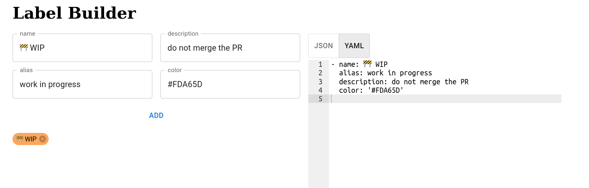

<div align="center">

<br>
<br>
<h1>Label Builder</h1>
</div>

[](https://app.netlify.com/sites/github-label-builder/deploys)

> 🚧 **WIP** 

**Design labels for GitHub and generate json or yaml code.**

## Usage 
A GitHub lable object looks something like this 

```yaml
- name: 🚧 WIP
  description: do not merge this PR
  alias:
    - work in progress
  color: '#FF5151'
```
This will look something like this  

The website lets you design mulitple lables and gives you the `json` or `yaml` code to use. You can also export multiple code at once. 

### Screen Shot

